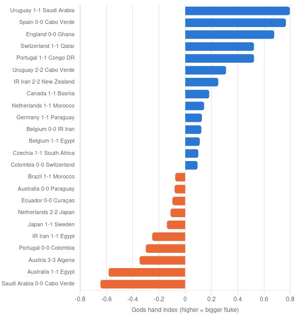

## Introduction 

World Cup 2026 was an international Football tournament consisted of 104 games and 48 teams (16 UEFA, 10 CAF, 9 AFC, 6 CONCACAF, 6 CONMEBOL, 1 OFC). 

## Win/Lose

Formula to predict game:

Step 1:\
Get mean, standart deviation of elo and xg\
Get const, elo_adv, prev_xg_adv

Step 2:
```
elo_adv = team_elo − opponent_elo
xg_adv  = team_xg  − opponent_xg
```
Step 3:
```
elo_adv* = (elo_adv − mean_elo) / sd_elo
xg_adv*  = (xg_adv  − mean_xg)  / sd_xg
```
Step 4:
```
z = β₀ + β₁·elo_adv* + β₂·xg_adv*
```
Step 5:
```
P(win) = 1 / (1 + e^(−z))
```

Example: Team A: Elo 1850, xG 2.1. Team B: Elo 1790, xG 1.4.
```
elo_adv = 1850 − 1790 = 60
xg_adv  = 2.1  − 1.4  = 0.7
Lets say mean_elo = 0, sd_elo = 150, mean_xg = 0, sd_xg = 0.9, and β = (0.05, 0.55, 0.40):
elo_adv* = (60−0)/150 = 0.40
xg_adv*  = (0.7−0)/0.9 = 0.78
z = 0.05 + 0.55(0.40) + 0.40(0.78) = 0.05 + 0.22 + 0.31 = 0.58
P(win) = 1/(1+e^−0.58) ≈ 1/(1+0.56) ≈ 64%
```
With this formula as we analyze all 104 games we come up with such result:

Total matches: 104  (includes 24 draws, which this binary model can't call)
Decisive matches (no draw): 80
Correct winner picks: 71 / 80 = 88.8%

Calibration (does '70% confidence' actually win ~70% of the time?):
| bucket   |n  |predicted_avg  |actual_win_rate|
|----------|:-:|:-------------:|:-------------:|
| 0-30% |102   |    0.118961       |   0.088235|
| 30-40%  |14   |    0.350338      |   0.500000|
| 40-50%  |17    |   0.457884      |   0.529412|
| 50-60%  |17     |  0.529549     |    0.588235|
| 60-70%  |14     |  0.662291    |     0.785714|
| 70-100%  |44    |   0.838699  |       0.772727|

For picking outright winners in a knockout-style setting (no draws possible), 89% is a strong hit rate for a 2-variable football model.

## Draws 

Draw is an anomaly, especially in Football. In order to take the draw into account, we need to detect the events that led the game to draw despite predicted advantages of teams. 

Actual draw scorelines confirm it: 20 of 24 draws (83%) were 0-0 or 1-1 — draws overwhelmingly happen in low-scoring, tightly controlled matches, not high-scoring shootouts that happen to level out.

Possession closeness, total shots closeness, corners closeness, and fouls closeness showed essentially no relationship to draws (p=0.30-0.65 across the board) — teams can dominate every surface stat and still not separate on the scoreboard, or vice versa

What actually explains the draws — favorites choked in front of goal
When favorites went on to actually win (71 matches), they averaged 4.99 shots on target and converted at 0.736 goals/SOT. In these 24 surprise draws, favorites still generated 4.54 shots on target (nearly the same volume of chances) — but converted at only 0.25 goals/SOT, roughly a 3x drop in finishing efficiency. Chance creation didn't collapse; composure/finishing did

What if the reason relies behind the dedication of less advantageous team? Did the underdog actually dominate?
I built an underdog "on-pitch dominance index" (z-scored possession edge + shots-on-target edge + corner edge + foul/discipline edge relative to the favorite) and correlated it against how big the predicted mismatch was (prob_gap = favorite prob − underdog prob).

Result: r = -0.003, p = 0.989 — essentially zero correlation. That's the first real finding: the bigger the model's expected blowout, the underdog didn't systematically play better, have more possession, or create more chances. So "the opponent played out of their skin" isn't the general story.

### The "God's Hand Index"

This term fits accurate into unexpected, unpredictable almost a miraculous situation. As it gets harder to detect the empirical events, we need an index of chance.

God's Hand Index = normalized(prob_gap) − normalized(underdog dominance)

High = model expected a landslide and the underdog showed no real stat-based case for earning a point — i.e., the draw is best explained by chance/luck/wasted favorite chances rather than the underdog's merit



How to read it: blue bars (positive) are the drawn matches where the model's mismatch was big but the underdog didn't actually earn it statistically — best explained by the favorite going cold in front of goal or plain variance. Orange bars (negative) are draws where the underdog genuinely out-stat'd the favorite (more possession, more shots on target, cleaner discipline), so the draw is less of a "fluke" and more of a deserved result.

A few notable individual stories worth flagging:

	1. Belgium 0-0 IR Iran (match 37) is the only draw in this set where the favorite finished with a man down (1 red card) — a clean mechanical explanation rather than "chance."

	2. Uruguay 1-1 Saudi Arabia and Spain 0-0 Cabo Verde top the index: both favorites piled up shots (27 and 23 respectively) but converted almost nothing, while the underdog didn't out-possess or out-shoot them by much.

	3. At the bottom, Saudi Arabia 0-0 Cabo Verde and Australia 1-1 Egypt are near coin-flip matchups anyway (prob_gap under 0.1), so calling them "upsets" at all is a stretch — the model barely favored anyone.
	
## Conclusion 

In conclusion, it can be said that even before the starting whistle blows by analyzing elo and previous expected goals of each team we have ~69% accuracy detecting the winner of 90 minutes. Concluding draws, this result goes up to ~89% in the manner of accuracy. This is abnormally accurate outcome for a Football match analysis, especially for national tournaments.

It should be noted that the dataset is obviously insufficient as it solely consists single tournament matches including only 104 games in a time period of 39 days. Therefore, to be fair to anyone in need of benefiting the results I have to warn you about any chances of error terms. Otherwise feel free to contribute or utilize the research.

## Reference

Islam, M. M. (2026). FIFA World Cup 2026 Dataset - Live & Daily Updated Stats (Version 1.0.0) [Data set]. Kaggle. https://www.kaggle.com/datasets/mominullptr/fifa-world-cup-2026-dataset
